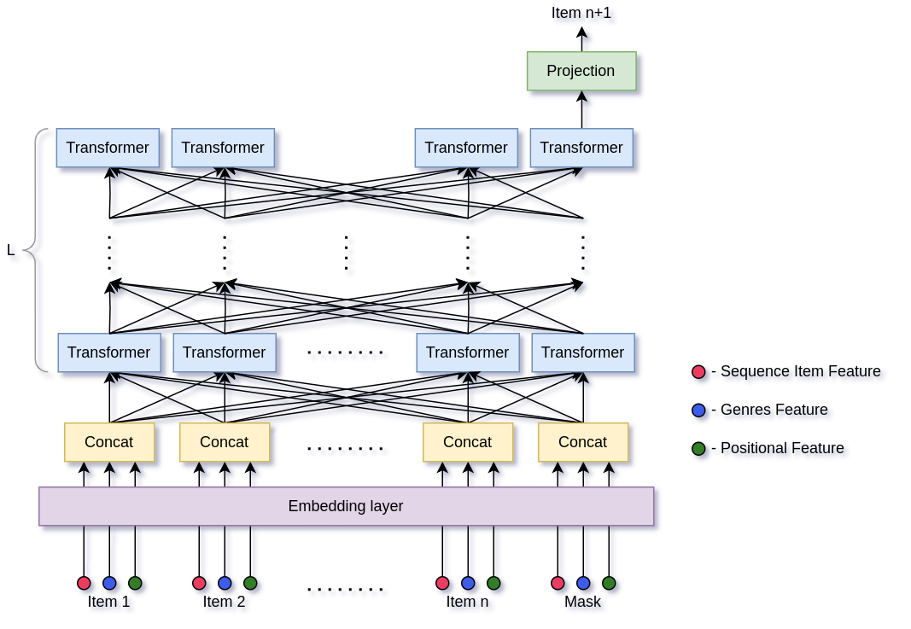

# BERT4Rec
Pytorch Implementation of the BERT4REC for MovieLens Dataset.

[Dataset download link](http://files.grouplens.org/datasets/movielens/ml-20m.zip)

This implementation contains an addition to the classic BERT4Rec. This model can take into account the genres of the films you have watched.

The resulting metrics:
- **NDCG@10**: 0.7689 
- **HR@10**: 0.95066

## Model Architecture

## Usage
- [`model.py`](model.py) - contains the code of the model
- [`dataset.py`](dataset.py) - contains the dataset processing code
- [`main.py`](main.py) - main file for train and eval model
- [`model_weights.pth`](model_weights.pth) - weights of the pre-training model

